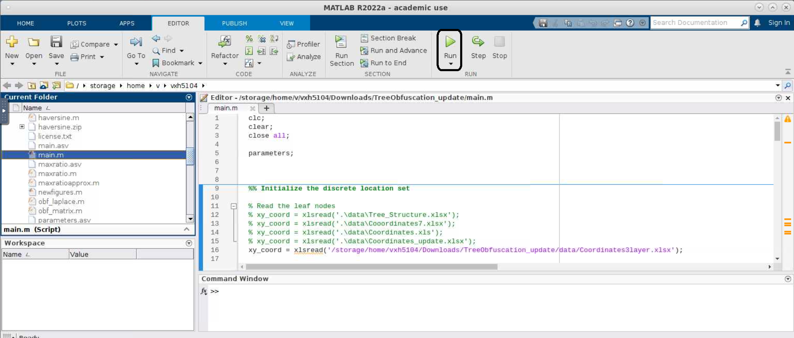

# CORGI #

Main repository for "CORGI: User Customizable and Robust Geo-Indistinguishability for Location Privacy"

## Brief Intro ##
CORGI ( Cust Omizable Robust Geo Indistinguishability), a framework for generating location obfuscation with strong privacy guarantees (based on Geo-Ind) that effectively allows users to balance the trade-off between privacy, utility, and customization. CORGI utilizes an untrusted server for performing the computationally heavy task of generating the obfuscation function while ensuring the privacy of the user.

<br />


## Repository Structure ##

```bash
├── Code
│   ├── haversine.m              * Calculates haversine distance between two locations.
│   ├── main.m                   * Execute this code to generate output file.
│   ├── parameters.m             * Set the values of various privacy parameters.
│   └── robust_obf_matrix2.m     * Generates robust obfuscation matrix depending on the input parameters.
├── Data
│   ├── Coordinates3layer.xlsx   * Latitude and Longitude values of 1 Parent node, 7 nodes in height-1, 
                                   49 nodes in height-2 and 343 nodes in height-3. 
│   └── prior_prob_343.mat       * Prior probability of all the 343 leaf nodes of the tree.
├── Results
│   ├── nr_violates1.mat         *
│   ├── nr_violates2.mat         *
│   ├── z_fval.mat               *
│   ├── z_fval_robust.mat        *
│   └── z_robust_diff.mat        *
└── README.md
```
## Code Guide ##
1. Install the MATLAB if it is not installed in your system.
2. Update the address of the data directory and the address of the ouput file to the approriate address in main.m (In Code directory).
    > xy_coord = xlsread('.\data\Coordinates3layer.xlsx')  <br />
    > load('.\data\prior_prob_343.mat')  <br />
    > save ('.\z_fval.mat', 'z_fval')  <br />
    > save ('.\z_fval_robust.mat', 'z_fval_robust')  <br />
    > save ('.\z_robust_diff.mat', 'z_robust_diff')  <br />
    > save ('.\nr_violates1.mat', 'nr_violates1')  <br />
    > save ('.\nr_violates2.mat', 'nr_violates2')  <br />
3. Update the values of the parameter.m (In Code directory) file. <br />
    a. NR_TASK - Number of Target location. <br />
    b. NR_LOC  - Total number of coordinates in the tree. <br />
    c. EPSILON - Privacy budget. <br />
    d. EPSILON_FIRST - Intial value of EPSILON. <br />
    e. EPSILON_LAST - End value of EPSILON. <br />
    f. EPSILON_INCR - Increment value for loop. <br />
    g. DELTA - Number of locations to be pruned. <br />
    h. DELTA_FIRST - Intial value of DELTA. <br />
    i. DELTA_LAST - End value of DELTA. <br />
    j. DELTA_INCR - Increment value for loop. <br />
    k. ITER_MAX - Number of interations for each delta value. <br />
4. Select the main.m and execute it by clicking "RUN" in MATLAB (In Code directory).

   
  
5. After execution is completed, 5 .mat file will be stored in data directory. <br />
    a. z_fval.mat <br />
    b. z_fval_robust.mat <br />
    c. z_robust_diff.mat <br />
    d. nr_violates1.mat <br />
    e. nr_violates2.mat <br />

## Correspondence ##

📬 Primal Pappachan [📜](mailto:primal@psu.edu) [Homepage](https://primalpappachan.com/)<br />
📬 Chenxi Qiu [📜](mailto:chenxi.qiu@unt.edu) [Homepage](https://computerscience.engineering.unt.edu/people/faculty/chenxi-qiu)<br />
📬 Anna Squicciarini [📜](mailto:acs20@psu.edu) [Homepage](https://faculty.ist.psu.edu/acs20/)<br />
📬 Vishnu Sharma Hunsur Manjunath [📜](mailto:vxh5104@psu.edu) [Homepage](mailto:vxh5104@psu.edu)<br />

## License

[BSD-3-Clause License](https://choosealicense.com/licenses/bsd-3-clause/)
